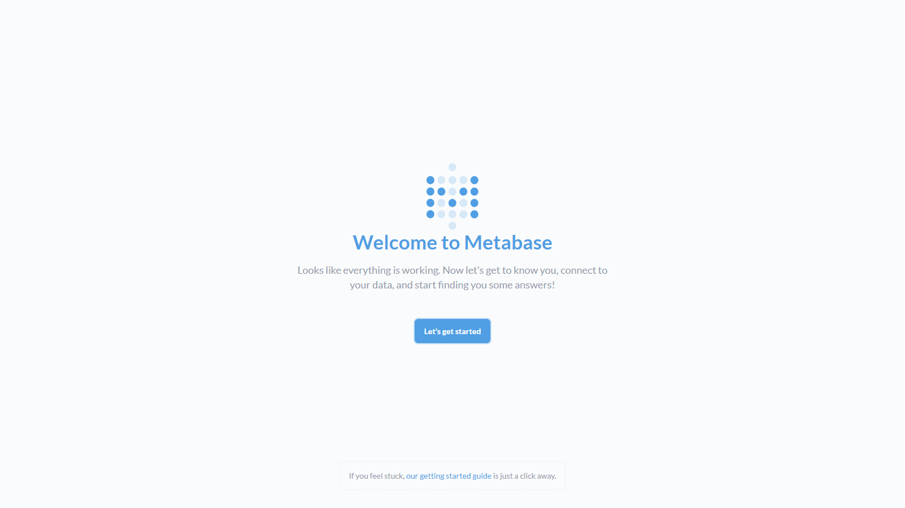

# Metabase-Postgres docker compose demo CI/CD pipeline

Example application and CI/CD pipeline showing how to deploy a Metabase-Postgres docker compose to elestio.

 
 

# Once deployed ...

You can open Metabase-Postgres web UI here:

    https://[CI_CD_DOMAIN]/
    login: [ADMIN_EMAIL] (set in env var ADMIN_EMAIL)
    password: [ADMIN_PASSWORD] (set in env var ADMIN_PASSWORD)

# Documentation

https://www.metabase.com/learn/getting-started/getting-started
